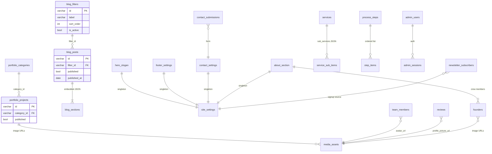

# NEDF Backend Schema & API Handoff

**Audience:** Backend team implementing persistence, auth, and public/admin APIs for the NEDF marketing site and dashboard.

**Frontend repo:** `Nedf/` (Next.js App Router)

**Canonical TypeScript types:** `lib/cms/types.ts`  
**CMS business logic:** `lib/cms/store.ts`  
**CMS HTTP client (dashboard + landing):** `lib/cms/client.ts`

**Last updated:** June 2026 — aligned with current frontend after dead-code cleanup.

---

## 1. Executive summary

| Area | Current state | Backend action |
|------|---------------|----------------|
| Blog + Portfolio CMS | Partial: `/api/cms/*` routes, JSON file in dev (`content/cms/store.json`) | **P0** — PostgreSQL + same JSON contract |
| Homepage content (slogan, services, steps, contact, footer, founders) | Browser `localStorage` only | **P1** — Site settings APIs |
| Admin auth | Plaintext creds in `localStorage` + `dashboardAuth=true` flag | **P0** — Real auth + protected writes |
| Contact form | UI only — submit is a stub | **P1** — `POST /api/contact` |
| Newsletter | Blog sidebar saves to `localStorage.subscribers`; footer form is display-only | **P1** — `POST /api/newsletter/subscribe` |
| Team / Reviews (dashboard) | `localStorage` via `lib/data-context.tsx` | **P2** — CRUD + wire landing |
| Landing testimonials | Hardcoded in `components/ClientReflections.tsx` | **P2** — Replace with `GET /api/reviews` |
| Landing team carousel | Hardcoded `TEAM_DATA` in `components/OurTeam.tsx` | **P2** — Wire to `team_members` |
| Hero stats | Hardcoded in `components/Stats.tsx` | **P3** — Optional CMS |
| Hero rotating words | Hardcoded in `components/Hero.tsx` | **P3** — Optional CMS |
| Portfolio 360° tour | Hardcoded iframe URL in portfolio detail page | **P2** — Add field to portfolio project |
| Legal pages | Static copy in `lib/legal-content.ts` | **P3** — Optional CMS |
| Portfolio profile (dashboard) | `localStorage.portfolioProfile` — not on public site | **P3** — Drop or merge into site settings |

**Production CMS note:** Writes to `content/cms/store.json` only succeed when `NODE_ENV=development`. In production, reads fall back to `lib/cms/defaults.ts` unless a database backs the routes.

---

## 2. Public site map (what consumes data)

| Public route | Data source today | Backend target |
|--------------|-------------------|----------------|
| `/` | CMS portfolio (carousel), `localStorage` slogan/services, hardcoded stats/testimonials/studio-notes CTA | Mixed APIs |
| `/about` | `landingCrew` (founders), hardcoded `OurTeam`, `landingSteps` | Site + team APIs |
| `/portfolio`, `/portfolio/[id]` | CMS (`/api/cms/portfolio*`) | Keep CMS APIs |
| `/blog`, `/blog/[id]` | CMS (`/api/cms/blogs*`) | Keep CMS APIs |
| `/contact` | `landingContact` + stub form | Contact settings + submissions API |
| `/privacy-policy`, `/terms-and-conditions` | `lib/legal-content.ts` | Static or legal CMS |

**Redirects (keep in gateway/nginx or Next config):**

- `/blog_detail` → `/blog` (permanent)
- `/dashbord-login` → `/dashboard-login` (permanent)

---

## 3. Dashboard map (admin UI → storage)

| Dashboard route | Sidebar label | Storage key / API | Wired to landing? |
|-----------------|---------------|-------------------|-------------------|
| `/dashboard/manage-blog` | Posts | CMS `blogs` | Yes |
| `/dashboard/manage-blog-filters` | Filters | CMS `blogFilters` | Yes |
| `/dashboard/manage-portfolio` | Projects | CMS `portfolio` | Yes |
| `/dashboard/manage-portfolio-categories` | Categories | CMS `portfolioCategories` | Yes |
| `/dashboard/manage-services` | Services | `landingServices` | Yes |
| `/dashboard/manage-steps` | Steps | `landingSteps` | Yes (`/about`) |
| `/dashboard/manage-slogan` | Slogan | `landingSlogan` | Yes (homepage) |
| `/dashboard/manage-contact` | Contact | `landingContact` | Yes (`/contact`) |
| `/dashboard/manage-subscribers` | Footer | `landingSubscription` | Yes (`Subscription.tsx` footer) |
| `/dashboard/manage-founders` | Founders | `landingCrew` | Yes (`TheCrew` on `/about`) |
| `/dashboard/manage-team` | Team | `teamMembers` | **No** — landing uses hardcoded team |
| `/dashboard/manage-review` | Reviews | `reviews` | **No** — landing uses hardcoded testimonials |
| `/dashboard/manage-login` | Login Page | `dashboardLoginConfig` | Auth only |
| `/dashboard/manage-profile` | (overview link only) | `portfolioProfile` | **No** — dashboard-only stub |

Sidebar definition: `app/dashboard/DashboardLayoutClient.tsx`

---

## 4. Entity relationship diagram



---

## 5. Database schema (PostgreSQL recommended)

Use **camelCase in JSON API responses** to match the frontend. Map to snake_case in SQL if preferred.

### 5.1 CMS — implement first (partially exists)

#### `blog_filters`

| Column | Type | Constraints | Notes |
|--------|------|-------------|-------|
| `id` | `VARCHAR(64)` | PK | Slug from label, e.g. `architecture` |
| `label` | `VARCHAR(255)` | NOT NULL | Display name |
| `sort_order` | `INT` | NOT NULL DEFAULT 0 | Admin list order |
| `is_active` | `BOOLEAN` | NOT NULL DEFAULT true | Inactive hidden on public site |
| `created_at` | `TIMESTAMPTZ` | NOT NULL DEFAULT now() | |
| `updated_at` | `TIMESTAMPTZ` | NOT NULL DEFAULT now() | |

#### `blog_posts`

| Column | Type | Constraints | Notes |
|--------|------|-------------|-------|
| `id` | `VARCHAR(64)` | PK | Stable URL segment: `/blog/[id]` |
| `title` | `VARCHAR(500)` | NOT NULL | |
| `description` | `TEXT` | NOT NULL | Summary / excerpt |
| `hero_image_url` | `TEXT` | NOT NULL | CDN URL (not base64) |
| `filter_id` | `VARCHAR(64)` | FK → `blog_filters.id`, NOT NULL | |
| `tags` | `JSONB` | NOT NULL DEFAULT `'[]'` | `string[]` legacy display tags |
| `sections` | `JSONB` | NOT NULL DEFAULT `'[]'` | See section shape below |
| `published` | `BOOLEAN` | NOT NULL DEFAULT false | Public API filters on this |
| `published_at` | `DATE` | | `YYYY-MM-DD` |
| `updated_at` | `DATE` | | `YYYY-MM-DD` |
| `created_at` | `TIMESTAMPTZ` | NOT NULL DEFAULT now() | |

**Embedded `blog_sections` JSON shape:**

```json
{
  "id": "section-1",
  "title": "Introduction",
  "content": "<p>HTML from rich text editor</p>",
  "level": 1,
  "number": "1",
  "images": ["https://cdn.example.com/img.jpg"]
}
```

**Indexes:** `(filter_id)`, `(published, published_at DESC)`.

#### `portfolio_categories`

Same columns as `blog_filters`.

#### `portfolio_projects`

| Column | Type | Constraints | Notes |
|--------|------|-------------|-------|
| `id` | `VARCHAR(64)` | PK | Stable URL: `/portfolio/[id]` |
| `title` | `VARCHAR(500)` | NOT NULL | |
| `category_id` | `VARCHAR(64)` | FK → `portfolio_categories.id`, NOT NULL | |
| `year` | `VARCHAR(10)` | | |
| `client` | `VARCHAR(255)` | | |
| `location` | `VARCHAR(255)` | | |
| `area` | `VARCHAR(100)` | | |
| `topology` | `VARCHAR(255)` | | Building type |
| `role` | `VARCHAR(255)` | | NEDF role on project |
| `status` | `VARCHAR(100)` | | e.g. Under construction |
| `inspiration` | `TEXT` | | |
| `description` | `TEXT` | | HTML allowed (rich text editor) |
| `features` | `JSONB` | NOT NULL DEFAULT `'[]'` | `string[]` |
| `materials` | `JSONB` | NOT NULL DEFAULT `'[]'` | `string[]` |
| `color_palette` | `JSONB` | NOT NULL DEFAULT `'[]'` | `string[]` hex colors |
| `before_image_url` | `TEXT` | | |
| `after_image_url` | `TEXT` | | |
| `gallery_images` | `JSONB` | NOT NULL DEFAULT `'[]'` | `string[]` URLs |
| `panorama_iframe_url` | `TEXT` | nullable | **Not in CMS yet** — hardcoded on detail page today |
| `panorama_image_url` | `TEXT` | nullable | Optional Pannellum image panorama |
| `published` | `BOOLEAN` | NOT NULL DEFAULT false | |
| `updated_at` | `DATE` | | |
| `created_at` | `TIMESTAMPTZ` | NOT NULL DEFAULT now() | |

**Indexes:** `(category_id)`, `(published)`.

**Gallery alt text:** Frontend auto-generates alts as `"${title} ${index+1}"` in `lib/cms/mappers.ts`. Optional future column: `gallery_alts JSONB`.

#### FK delete rules (taxonomy)

Mirrors `lib/cms/store.ts`:

- Deleting a `blog_filter` or `portfolio_category` that is referenced **requires** `reassignToId` in DELETE body, or return **409 Conflict**.
- On reassignment, update all child rows and bump `updated_at` to today (`YYYY-MM-DD`).

---

### 5.2 Site content — currently `localStorage`

#### `hero_slogan` (singleton)

| Column | Type |
|--------|------|
| `line1` | `VARCHAR(255)` |
| `line2` | `VARCHAR(255)` |
| `line3` | `VARCHAR(255)` |

| | |
|--|--|
| **TypeScript** | `SloganData` — `lib/landing-slogan.ts` |
| **localStorage key** | `landingSlogan` (`LANDING_SLOGAN_KEY` in `lib/constants.ts`) |
| **Dashboard** | `/dashboard/manage-slogan` |
| **Landing component** | `components/Slogan.tsx` (GSAP scroll animation) |

#### `services`

| Column | Type | Notes |
|--------|------|-------|
| `id` | `VARCHAR(64)` PK | e.g. `design` |
| `name` | `VARCHAR(255)` | |
| `category` | `VARCHAR(255)` | Section label, e.g. `DESIGN SERVICES` |
| `headline` | `VARCHAR(500)` | |
| `cta` | `VARCHAR(100)` | Button label |
| `image_url` | `TEXT` | |
| `sub_services` | `JSONB` | `string[]` |
| `sort_order` | `INT` | Preserve array order |

| | |
|--|--|
| **TypeScript** | `LandingService` — `app/dashboard/manage-services/services-data.ts` |
| **localStorage key** | `landingServices` |
| **Dashboard** | `/dashboard/manage-services` |
| **Landing component** | `components/services.tsx` |

#### `process_steps`

| Column | Type | Notes |
|--------|------|-------|
| `id` | `INT` PK | Stable step id (1–5 in defaults) |
| `quote` | `TEXT` | |
| `name` | `VARCHAR(100)` | Step name: Design, Think, … |
| `role` | `VARCHAR(50)` | Display: Step 1, Step 2, … |
| `avatar` | `VARCHAR(100)` | Label text used in arc animation |
| `sort_order` | `INT` | |

| | |
|--|--|
| **TypeScript** | `StepItem` — `lib/landing-steps.ts` |
| **localStorage key** | `landingSteps` |
| **Dashboard** | `/dashboard/manage-steps` |
| **Landing component** | `components/Steps.tsx` on `/about` |

#### `contact_settings` (singleton)

| | |
|--|--|
| **TypeScript** | `ContactData` — `lib/landing-contact.ts` |
| **localStorage key** | `landingContact` |
| **Dashboard** | `/dashboard/manage-contact` |
| **Landing page** | `app/(landing)/contact/page.tsx` |

**JSON shape:**

```typescript
interface ContactData {
  info: {
    address: string
    email: string
    phone: string
    phoneSecondary: string
    availability: string
  }
  page: {
    title: string
    subtitle: string
    formTitle: string
    sendButtonLabel: string
    companyInfoTitle: string
    socialLabel: string
  }
  formLabels: {
    fullName: string
    email: string
    subject: string
    message: string
  }
  socialLinks: { name: string; href: string }[]
}
```

Defaults seeded from `lib/constants.ts` (`CONTACT_INFO`, `CONTACT_PAGE`, etc.).

**Contact form submission (not persisted today):**

| Field | Type | Required |
|-------|------|----------|
| `fullName` | string | yes |
| `email` | string | yes |
| `subject` | string | no |
| `message` | string | yes |

> **Important:** `lib/validations.ts` defines `firstName`/`lastName` — the live form uses a single `fullName` field. Backend must match the UI.

#### `footer_settings` (singleton)

| | |
|--|--|
| **TypeScript** | `SubscriptionData` — `lib/landing-subscription.ts` |
| **localStorage key** | `landingSubscription` |
| **Dashboard** | `/dashboard/manage-subscribers` (sidebar: “Footer”) |
| **Landing component** | `components/Subscription.tsx` (default export name `Footer`) |

**JSON shape:**

```typescript
interface SubscriptionData {
  logoLight: string
  logoDark: string
  quickLinks: { label: string; href: string }[]
  contact: {
    email: string
    phonePrimary: string
    phoneSecondary: string
  }
  social: {
    linkedin?: string
    instagram?: string
    tiktok?: string
    x?: string
    youtube?: string
  }
  newsletter: {
    placeholder: string
    buttonLabel: string
    description: string
  }
  policyLinks: { label: string; href: string }[]
  copyright: string
}
```

Footer newsletter input is **display-only** today (no submit handler). Only `BlogSubscribeSidebar` persists signups.

#### `about_section` + `founders`

| | |
|--|--|
| **TypeScript** | `CrewSectionData` / `CrewMember` — `lib/landing-crew.ts` |
| **localStorage key** | `landingCrew` |
| **Dashboard** | `/dashboard/manage-founders` |
| **Landing component** | `components/TheCrew.tsx` on `/about` |

**`about_section` (singleton):**

| Column | Type |
|--------|------|
| `about_description` | TEXT |

**`founders`:**

| Column | Type |
|--------|------|
| `id` | VARCHAR PK |
| `name` | VARCHAR |
| `title` | VARCHAR — job title, e.g. Co-founder |
| `description` | TEXT |
| `image_url` | TEXT |
| `image_dark_url` | TEXT nullable |
| `hover_image_url` | TEXT nullable |
| `social` | JSONB — `{ instagram?, tiktok?, linkedin?, pinterest?, behance?, x?, youtube? }` |
| `sort_order` | INT |

> **Do not migrate** `localStorage.founders` from `lib/data-context.tsx` — orphaned duplicate. Landing reads `landingCrew` only.

---

### 5.3 People & social proof

#### `team_members`

| | |
|--|--|
| **TypeScript** | `TeamMember` — `lib/data-context.tsx` |
| **localStorage key** | `teamMembers` |
| **Dashboard** | `/dashboard/manage-team` |
| **Landing** | **Not wired** — `components/OurTeam.tsx` uses hardcoded `TEAM_DATA` |

| Column | Type |
|--------|------|
| `id` | VARCHAR PK |
| `name` | VARCHAR |
| `position` | VARCHAR |
| `description` | TEXT |
| `email` | VARCHAR nullable |
| `avatar_url` | TEXT nullable |
| `social_media` | JSONB — instagram, tiktok, behance, pinterest, linkedin, twitter, github, website |
| `sort_order` | INT |

**Landing `OurTeam` expects (when wired):**

```typescript
interface LandingTeamMember {
  name: string
  role: string
  bio: string
  image: string
  socials?: { linkedin?, instagram?, twitter?, dribbble? }
}
```

Map `position` → `role`, `description` → `bio`, `avatar_url` → `image`.

#### `reviews` (testimonials)

| | |
|--|--|
| **TypeScript** | `Review` — `lib/data-context.tsx` |
| **localStorage key** | `reviews` |
| **Dashboard** | `/dashboard/manage-review` |
| **Landing** | **Not wired** — `components/ClientReflections.tsx` uses hardcoded array |

| Column | Type |
|--------|------|
| `id` | VARCHAR PK |
| `name` | VARCHAR |
| `position` | VARCHAR |
| `testimonial` | TEXT |
| `profile_picture_url` | TEXT nullable |
| `company` | VARCHAR nullable | Landing shows `work` field — add when wiring |
| `published` | BOOLEAN DEFAULT true |
| `sort_order` | INT |

**Landing testimonial shape (target for API mapping):**

```typescript
interface LandingTestimonial {
  id: number | string
  quote: string
  name: string
  role: string
  avatar: string      // initials fallback
  photo: string       // profile image URL
  work: string        // company name
}
```

#### `hero_stats` (optional — hardcoded today)

`components/Stats.tsx` — not in dashboard:

```typescript
{ value: "100+", label: "Projects Completed" }
{ value: "95%", label: "Client Engagement Rate" }
{ value: "98%", label: "Client Satisfaction Rate" }
{ value: "99%", label: "On-Time Project Completion" }
```

#### `portfolio_profile` (dashboard-only stub)

**localStorage key:** `portfolioProfile`  
**Dashboard:** `/dashboard/manage-profile` (linked from overview, not in sidebar)

```typescript
interface PortfolioProfile {
  description: string
  phoneNumber1: string
  phoneNumber2: string
  email: string
  socialMedia: {
    instagram: string
    tiktok: string
    linkedin: string
    pinterest: string
    behance: string
    twitter: string
  }
}
```

Not displayed on public site — low priority or merge into contact/footer settings.

---

### 5.4 Auth & admin

Replace `dashboardLoginConfig` and client-side `dashboardAuth`.

#### `admin_users`

| Column | Type |
|--------|------|
| `id` | UUID PK |
| `username` | VARCHAR UNIQUE NOT NULL |
| `password_hash` | VARCHAR NOT NULL — bcrypt or argon2 |
| `email` | VARCHAR nullable |
| `role` | VARCHAR — `admin` \| `editor` |
| `last_login_at` | TIMESTAMPTZ |
| `created_at` | TIMESTAMPTZ |
| `updated_at` | TIMESTAMPTZ |

**Dev defaults today** (`lib/dashboard-login-config.ts`):

| Key | Default |
|-----|---------|
| `dashboardLoginConfig.username` | `nedfteam` |
| `dashboardLoginConfig.password` | `nedf123` |

**Session flag today:** `localStorage.dashboardAuth = "true"` after login on `/dashboard-login`.

**Never ship plaintext passwords to production.**

#### Sessions

Use HTTP-only cookies or JWT refresh tokens. Protect:

- All CMS mutation routes (`POST`, `PUT`, `PATCH`, `DELETE` under `/api/cms/*`)
- All proposed site settings write routes
- Admin list endpoints (optional: public read for published content only)

---

### 5.5 Public submissions

#### `newsletter_subscribers`

| | |
|--|--|
| **localStorage key** | `subscribers` |
| **Signup UI** | `components/BlogSubscribeSidebar.tsx` (blog detail/list, 2xl+ sidebar) |
| **Footer form** | `components/Subscription.tsx` — **not connected** |

| Column | Type |
|--------|------|
| `id` | VARCHAR or UUID PK |
| `email` | VARCHAR UNIQUE NOT NULL |
| `subscribed_at` | TIMESTAMPTZ NOT NULL |
| `source` | VARCHAR — e.g. `blog_sidebar`, `footer` |
| `unsubscribed_at` | TIMESTAMPTZ nullable |

**Current localStorage row shape:**

```json
{ "id": "sub-1710000000000", "email": "user@example.com", "subscribedAt": "2026-06-11" }
```

**Rules:** Dedupe by email (case-insensitive). Basic regex validation on frontend.

#### `contact_submissions`

| Column | Type |
|--------|------|
| `id` | UUID PK |
| `full_name` | VARCHAR NOT NULL |
| `email` | VARCHAR NOT NULL |
| `subject` | VARCHAR |
| `message` | TEXT NOT NULL |
| `status` | VARCHAR — `new`, `read`, `replied`, `archived` |
| `created_at` | TIMESTAMPTZ |
| `ip_address` | INET nullable |

---

### 5.6 Media

Dashboard uploads often become **base64 data URLs** in `localStorage`. Backend must use object storage and persist URLs only.

#### `media_assets`

| Column | Type |
|--------|------|
| `id` | UUID PK |
| `url` | TEXT NOT NULL |
| `mime_type` | VARCHAR |
| `filename` | VARCHAR |
| `size_bytes` | BIGINT |
| `uploaded_by` | UUID FK → `admin_users.id` |
| `created_at` | TIMESTAMPTZ |

**Endpoint:** `POST /api/media/upload` (admin, multipart) → `{ id, url }`.

---

### 5.7 Legal content (optional CMS)

**Source:** `lib/legal-content.ts`

| Table | Columns |
|-------|---------|
| `legal_pages` | `slug` PK (`privacy-policy`, `terms-and-conditions`), `title`, `last_updated` |
| `legal_sections` | `id`, `page_slug` FK, `sort_order`, `title`, `paragraphs` JSONB `string[]` |

**Landing pages:** `app/(landing)/privacy-policy/page.tsx`, `terms-and-conditions/page.tsx` via `components/LegalPage.tsx`.

---

## 6. Existing API contract (implement in real backend)

**Routes:** `app/api/cms/**`  
**Client:** `lib/cms/client.ts` (`cmsApi` object)  
**Dev persistence:** `content/cms/store.json`

### 6.1 Blog filters — `/api/cms/blog-filters`

| Method | Path | Query | Body | Response | Errors |
|--------|------|-------|------|----------|--------|
| GET | `/api/cms/blog-filters` | `admin=1` optional | — | `CmsBlogFilter[]` | |
| POST | `/api/cms/blog-filters` | — | `{ label: string }` | Created filter | 500 |
| PATCH | `/api/cms/blog-filters/:id` | — | `{ label?, sortOrder?, isActive? }` | Updated filter | 404, 500 |
| DELETE | `/api/cms/blog-filters/:id` | — | `{ reassignToId?: string }` | `{ success: true }` | 409 if in use, 500 |

Public GET: active filters only, sorted by `sortOrder`.

### 6.2 Blog posts — `/api/cms/blogs`

| Method | Path | Query | Body | Response | Errors |
|--------|------|-------|------|----------|--------|
| GET | `/api/cms/blogs` | `admin=1` optional | — | `CmsBlogPost[]` | |
| POST | `/api/cms/blogs` | — | Full `CmsBlogPost` | Created post | 400 missing title/filterId, 500 |
| GET | `/api/cms/blogs/:id` | — | — | `CmsBlogPost` | 404 |
| PUT | `/api/cms/blogs/:id` | — | Partial/full post | Updated post | 404, 500 |
| DELETE | `/api/cms/blogs/:id` | — | — | `{ success: true }` | 404, 500 |

POST auto-fills: `id` (`blog-${Date.now()}` if missing), `published` (default true), `publishedAt` / `updatedAt` (today `YYYY-MM-DD`).

Public GET: `published === true` only.

### 6.3 Portfolio categories — `/api/cms/portfolio-categories`

Same CRUD pattern as blog filters.

### 6.4 Portfolio projects — `/api/cms/portfolio`

Same CRUD pattern as blogs. POST requires `title` and `categoryId`.

### 6.5 TypeScript types (JSON bodies)

```typescript
interface CmsBlogFilter {
  id: string
  label: string
  sortOrder: number
  isActive: boolean
}

interface CmsBlogSection {
  id: string
  title: string
  content: string
  level: number
  number: string
  images?: string[]
}

interface CmsBlogPost {
  id: string
  title: string
  description: string
  heroImage: string
  filterId: string
  tags: string[]
  sections: CmsBlogSection[]
  published: boolean
  publishedAt: string   // YYYY-MM-DD
  updatedAt: string
}

interface CmsPortfolioCategory {
  id: string
  label: string
  sortOrder: number
  isActive: boolean
}

interface CmsPortfolioProject {
  id: string
  title: string
  categoryId: string
  year: string
  client: string
  location: string
  area: string
  topology: string
  role: string
  status: string
  inspiration: string
  description: string
  features: string[]
  materials: string[]
  colorPalette: string[]
  beforeImage: string
  afterImage: string
  galleryImages: string[]
  published: boolean
  updatedAt: string
}

interface CmsStore {
  blogFilters: CmsBlogFilter[]
  portfolioCategories: CmsPortfolioCategory[]
  blogs: CmsBlogPost[]
  portfolio: CmsPortfolioProject[]
}
```

---

## 7. Proposed API surface (not built yet)

```
POST   /api/auth/login              { username, password } → Set-Cookie or { token }
POST   /api/auth/logout
GET    /api/auth/me

GET    /api/site/settings           Optional bundle of all singletons
PUT    /api/site/slogan             SloganData
GET    /api/site/services           LandingService[]
PUT    /api/site/services
GET    /api/site/steps              StepItem[]
PUT    /api/site/steps
GET    /api/site/contact            ContactData
PUT    /api/site/contact
GET    /api/site/footer             SubscriptionData
PUT    /api/site/footer
GET    /api/site/about              { aboutDescription, crew: CrewMember[] }
PUT    /api/site/about

GET    /api/team                    Public published team (when landing wired)
POST   /api/team                    Admin
GET    /api/team/:id
PUT    /api/team/:id
DELETE /api/team/:id

GET    /api/reviews                 ?published=1 for public
POST   /api/reviews                 Admin
PUT    /api/reviews/:id
DELETE /api/reviews/:id

POST   /api/contact                 Public — { fullName, email, subject?, message }
POST   /api/newsletter/subscribe    Public — { email, source? }
GET    /api/newsletter/subscribers  Admin only

POST   /api/media/upload            Admin — multipart/form-data
```

Optional version prefix: `/api/v1/...`.

**Suggested public site bundle (SSR-friendly):**

```
GET /api/public/home
→ { slogan, services, portfolioPreview[], footer, ... }
```

---

## 8. localStorage → database migration map

| localStorage key | Target table(s) | Priority | Notes |
|------------------|-----------------|----------|-------|
| `content/cms/store.json` | blog_filters, blog_posts, portfolio_categories, portfolio_projects | **P0** | File path: `content/cms/store.json` |
| `dashboardLoginConfig` | admin_users | **P0** | Hash passwords |
| `dashboardAuth` | sessions / JWT | **P0** | Remove client flag |
| `landingSlogan` | hero_slogan | P1 | |
| `landingServices` | services | P1 | |
| `landingSteps` | process_steps | P1 | |
| `landingContact` | contact_settings | P1 | |
| `landingSubscription` | footer_settings | P1 | |
| `landingCrew` | about_section + founders | P1 | |
| `subscribers` | newsletter_subscribers | P1 | |
| `teamMembers` | team_members | P2 | Wire `OurTeam.tsx` |
| `reviews` | reviews | P2 | Wire `ClientReflections.tsx` |
| `portfolioProfile` | Optional / drop | P3 | Dashboard-only |
| `founders` (data-context) | **Ignore** | — | Orphaned duplicate |

---

## 9. Business rules

1. **Taxonomy delete:** Cannot delete blog filter / portfolio category if referenced unless `reassignToId` is provided → **409 Conflict**.
2. **Slug IDs:** New filters/categories get slug IDs from label; append `-1`, `-2`, … on collision (`slugify` in `lib/cms/store.ts`).
3. **Publishing:** Public endpoints and sitemap only expose `published = true` records.
4. **Stable IDs:** Blog and portfolio detail URLs use string IDs — do not regenerate on update.
5. **Dates:** CMS uses ISO date strings `YYYY-MM-DD` for `publishedAt` / `updatedAt`.
6. **Rich text:** Blog sections and portfolio descriptions store HTML strings (TipTap editor: `components/rich-text-editor.tsx`).
7. **Newsletter:** Reject duplicate emails (case-insensitive); validate email format.
8. **SEO:** Set `NEXT_PUBLIC_SITE_URL` in production (`lib/seo.ts`, sitemap, Open Graph).
9. **Images:** Reject or migrate base64 blobs — store CDN URLs only in DB.
10. **CORS / cookies:** Dashboard and public site may share origin; use SameSite cookies if monolith.

---

## 10. Environment variables

| Variable | Purpose |
|----------|---------|
| `NEXT_PUBLIC_SITE_URL` | Canonical site URL for metadata, sitemap, JSON-LD |
| `NODE_ENV` | CMS file writes gated to `development` today |
| `DATABASE_URL` | PostgreSQL connection (backend) |
| `JWT_SECRET` or session secret | Auth (backend) |
| `S3_*` / `CLOUDINARY_*` | Media storage (backend) |

---

## 11. Suggested implementation order

1. PostgreSQL + migrations for CMS tables  
2. Admin auth (hash passwords, protect all write routes)  
3. Port existing `/api/cms/*` from JSON file to DB — **keep response shapes identical**  
4. Media upload service (S3, Cloudinary, etc.)  
5. Site settings APIs (slogan, services, steps, contact, footer, founders)  
6. Newsletter + contact submission endpoints  
7. Team + reviews CRUD; wire landing `OurTeam` + `ClientReflections`  
8. Add `panoramaIframeUrl` to portfolio CMS + detail page  
9. Legal CMS (optional)  
10. Hero stats / hero words CMS (optional)

---

## 12. Frontend integration checklist (after backend is ready)

- [ ] Replace `localStorage` loaders in `lib/landing-*.ts` with fetch + SSR where needed  
- [ ] Add auth headers or cookies to `cmsApi` and new site API clients  
- [ ] Wire contact form in `app/(landing)/contact/page.tsx` → `POST /api/contact`  
- [ ] Wire `BlogSubscribeSidebar` → `POST /api/newsletter/subscribe`  
- [ ] Wire footer newsletter in `Subscription.tsx` (currently display-only)  
- [ ] Replace `dashboard-login` localStorage auth with real session  
- [ ] Upload images via `/api/media/upload` instead of base64 in JSON  
- [ ] Connect `ClientReflections.tsx` → `GET /api/reviews?published=1`  
- [ ] Connect `OurTeam.tsx` → `GET /api/team`  
- [ ] Update dashboard overview stats (`app/dashboard/page.tsx`) to use API counts  
- [ ] Extend `CmsPortfolioProject` + DB with panorama fields; remove hardcoded iframe URL  
- [ ] Align or remove unused `lib/validations.ts` (firstName/lastName vs fullName)

---

## 13. Source file index

| Domain | File |
|--------|------|
| CMS types | `lib/cms/types.ts` |
| CMS store / business logic | `lib/cms/store.ts` |
| CMS defaults / seed data | `lib/cms/defaults.ts` |
| CMS → landing mappers | `lib/cms/mappers.ts` |
| CMS fetch client | `lib/cms/client.ts` |
| CMS JSON file (dev) | `content/cms/store.json` |
| Services | `app/dashboard/manage-services/services-data.ts` |
| Slogan | `lib/landing-slogan.ts` |
| Steps | `lib/landing-steps.ts` |
| Contact | `lib/landing-contact.ts` |
| Footer / subscription block | `lib/landing-subscription.ts` |
| Founders / About crew | `lib/landing-crew.ts` |
| Team / Reviews context | `lib/data-context.tsx` |
| Login config | `lib/dashboard-login-config.ts` |
| Shared constants & storage keys | `lib/constants.ts` |
| Contact validation (legacy, unused by live form) | `lib/validations.ts` |
| Legal copy | `lib/legal-content.ts` |
| SEO helpers | `lib/seo.ts` |
| Dashboard sidebar routes | `app/dashboard/DashboardLayoutClient.tsx` |
| Landing homepage stack | `app/(landing)/HomePageClient.tsx`, `components/LandingStack.tsx` |
| Testimonials (hardcoded) | `components/ClientReflections.tsx` |
| Team carousel (hardcoded) | `components/OurTeam.tsx` |
| Blog newsletter signup | `components/BlogSubscribeSidebar.tsx` |
| Public footer | `components/Subscription.tsx` |

---

## 14. CMS API route files (reference)

```
app/api/cms/blog-filters/route.ts
app/api/cms/blog-filters/[id]/route.ts
app/api/cms/blogs/route.ts
app/api/cms/blogs/[id]/route.ts
app/api/cms/portfolio-categories/route.ts
app/api/cms/portfolio-categories/[id]/route.ts
app/api/cms/portfolio/route.ts
app/api/cms/portfolio/[id]/route.ts
```

---

*Questions about frontend contracts: inspect the TypeScript types above or the referenced `lib/` files — they are the source of truth until OpenAPI specs are generated.*
