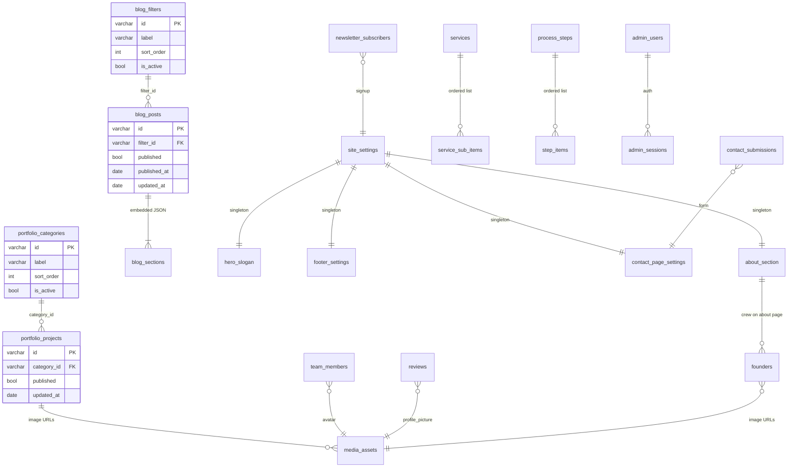

# NEDF Backend Schema & API Handoff

This document describes the data model, relationships, and API surface the backend team should implement when replacing the current frontend-only persistence (JSON file + `localStorage`).

**Frontend repo paths:** types in `lib/cms/types.ts`, CMS logic in `lib/cms/store.ts`, CMS client in `lib/cms/client.ts`.

---

## 1. Current architecture

| Layer | Status |
|--------|--------|
| **Blog + Portfolio CMS** | Partial backend: Next.js routes under `/api/cms/*`, JSON file in dev only (`content/cms/store.json`) |
| **Homepage / company content** | Browser `localStorage` only — not persisted server-side |
| **Auth** | Client-only: `localStorage.dashboardAuth = "true"` + plaintext credentials in `dashboardLoginConfig` |
| **Contact form** | UI only — submit handler is a stub (`app/(landing)/contact/page.tsx`) |
| **Newsletter signups** | Saved to `localStorage.subscribers` |
| **Legal pages** | Static TypeScript in `lib/legal-content.ts` |
| **Landing testimonials** | Hardcoded in components — **not** connected to dashboard `reviews` |

**Production note:** CMS writes to `store.json` only work when `NODE_ENV=development`. Production currently falls back to defaults in `lib/cms/defaults.ts` unless a real database is added.

---

## 2. Entity relationship diagram



---

## 3. Database schema (PostgreSQL recommended)

### 3.1 CMS — implement first (partially exists in frontend)

Types are defined in `lib/cms/types.ts`.

#### `blog_filters`

| Column | Type | Constraints | Notes |
|--------|------|-------------|-------|
| `id` | `VARCHAR(64)` | PK | Slug from label, e.g. `architecture` |
| `label` | `VARCHAR(255)` | NOT NULL | Display name |
| `sort_order` | `INT` | NOT NULL DEFAULT 0 | Admin list order |
| `is_active` | `BOOLEAN` | NOT NULL DEFAULT true | Inactive hidden on public site |
| `created_at` | `TIMESTAMPTZ` | NOT NULL DEFAULT now() | |
| `updated_at` | `TIMESTAMPTZ` | NOT NULL DEFAULT now() | |

#### `blog_posts`

| Column | Type | Constraints | Notes |
|--------|------|-------------|-------|
| `id` | `VARCHAR(64)` | PK | Stable URL segment: `/blog/[id]` |
| `title` | `VARCHAR(500)` | NOT NULL | |
| `description` | `TEXT` | NOT NULL | Summary / excerpt |
| `hero_image_url` | `TEXT` | NOT NULL | CDN URL (not base64) |
| `filter_id` | `VARCHAR(64)` | FK → `blog_filters.id`, NOT NULL | |
| `tags` | `JSONB` | NOT NULL DEFAULT `'[]'` | `string[]` legacy display tags |
| `sections` | `JSONB` | NOT NULL DEFAULT `'[]'` | See section shape below |
| `published` | `BOOLEAN` | NOT NULL DEFAULT false | Public API filters on this |
| `published_at` | `DATE` | | |
| `updated_at` | `DATE` | | |
| `created_at` | `TIMESTAMPTZ` | NOT NULL DEFAULT now() | |

**Embedded `blog_sections` JSON shape:**

```json
{
  "id": "section-1",
  "title": "Introduction",
  "content": "<p>HTML from rich text editor</p>",
  "level": 1,
  "number": "1",
  "images": ["https://cdn.example.com/img.jpg"]
}
```

**Indexes:** `(filter_id)`, `(published, published_at DESC)`.

#### `portfolio_categories`

Same columns as `blog_filters`.

#### `portfolio_projects`

| Column | Type | Constraints | Notes |
|--------|------|-------------|-------|
| `id` | `VARCHAR(64)` | PK | Stable URL: `/portfolio/[id]` |
| `title` | `VARCHAR(500)` | NOT NULL | |
| `category_id` | `VARCHAR(64)` | FK → `portfolio_categories.id`, NOT NULL | |
| `year` | `VARCHAR(10)` | | |
| `client` | `VARCHAR(255)` | | |
| `location` | `VARCHAR(255)` | | |
| `area` | `VARCHAR(100)` | | |
| `topology` | `VARCHAR(255)` | | Building type |
| `role` | `VARCHAR(255)` | | NEDF role on project |
| `status` | `VARCHAR(100)` | | e.g. Underconstruction |
| `inspiration` | `TEXT` | | |
| `description` | `TEXT` | | |
| `features` | `JSONB` | NOT NULL DEFAULT `'[]'` | `string[]` |
| `materials` | `JSONB` | NOT NULL DEFAULT `'[]'` | `string[]` |
| `color_palette` | `JSONB` | NOT NULL DEFAULT `'[]'` | `string[]` hex colors |
| `before_image_url` | `TEXT` | | |
| `after_image_url` | `TEXT` | | |
| `gallery_images` | `JSONB` | NOT NULL DEFAULT `'[]'` | `string[]` URLs |
| `published` | `BOOLEAN` | NOT NULL DEFAULT false | |
| `updated_at` | `DATE` | | |
| `created_at` | `TIMESTAMPTZ` | NOT NULL DEFAULT now() | |

**Indexes:** `(category_id)`, `(published)`.

#### FK delete rules

Both taxonomies use the same logic as `lib/cms/store.ts`:

- Deleting a `blog_filter` or `portfolio_category` that is referenced **requires** a `reassign_to_id` body field, or return **409 Conflict**.
- On reassignment, update all child rows and bump `updated_at`.

---

### 3.2 Site content — currently `localStorage`

#### `hero_slogan` (singleton, one row)

| Column | Type |
|--------|------|
| `line1` | `VARCHAR(255)` |
| `line2` | `VARCHAR(255)` |
| `line3` | `VARCHAR(255)` |

**Frontend type:** `SloganData` — `lib/landing-slogan.ts`  
**localStorage key:** `landingSlogan`  
**Dashboard:** `/dashboard/manage-slogan`

#### `services`

| Column | Type | Notes |
|--------|------|-------|
| `id` | `VARCHAR(64)` PK | e.g. `design` |
| `name` | `VARCHAR(255)` | |
| `category` | `VARCHAR(255)` | Section label, e.g. DESIGN SERVICES |
| `headline` | `VARCHAR(500)` | |
| `cta` | `VARCHAR(100)` | Button label |
| `image_url` | `TEXT` | |
| `sub_services` | `JSONB` | `string[]` — or normalize to `service_sub_items` |
| `sort_order` | `INT` | |

**Frontend type:** `LandingService` — `app/dashboard/manage-services/services-data.ts`  
**localStorage key:** `landingServices`  
**Dashboard:** `/dashboard/manage-services`

#### `process_steps`

| Column | Type | Notes |
|--------|------|-------|
| `id` | `INT` PK | |
| `quote` | `TEXT` | |
| `name` | `VARCHAR(100)` | Step name: Design, Think, … |
| `role` | `VARCHAR(50)` | Display: Step 1, Step 2, … |
| `avatar` | `VARCHAR(100)` | Label/icon text today |
| `sort_order` | `INT` | |

**Frontend type:** `StepItem` — `lib/landing-steps.ts`  
**localStorage key:** `landingSteps`  
**Dashboard:** `/dashboard/manage-steps`

#### `contact_settings` (singleton or normalized)

**Frontend type:** `ContactData` — `lib/landing-contact.ts`  
**localStorage key:** `landingContact`  
**Dashboard:** `/dashboard/manage-contact`

| Group | Fields |
|-------|--------|
| `info` | `address`, `email`, `phone`, `phone_secondary`, `availability` |
| `page` | `title`, `subtitle`, `form_title`, `send_button_label`, `company_info_title`, `social_label` |
| `form_labels` | `full_name`, `email`, `subject`, `message` |
| `social_links` | JSONB array of `{ name, href }` |

Store as one JSONB column `payload` or split into columns — frontend merges with defaults on read.

#### `footer_settings` (singleton)

**Frontend type:** `SubscriptionData` — `lib/landing-subscription.ts`  
**localStorage key:** `landingSubscription`  
**Dashboard:** `/dashboard/manage-subscribers` (labeled “Footer” in sidebar)

| Field | Type |
|-------|------|
| `logo_light_url` | TEXT |
| `logo_dark_url` | TEXT |
| `quick_links` | JSONB `{ label, href }[]` |
| `contact` | JSONB `{ email, phone_primary, phone_secondary }` |
| `social` | JSONB optional platform URLs (linkedin, instagram, tiktok, x, youtube) |
| `newsletter` | JSONB `{ placeholder, button_label, description }` |
| `policy_links` | JSONB `{ label, href }[]` |
| `copyright` | VARCHAR |

#### `about_section` + `founders`

**Frontend type:** `CrewSectionData` / `CrewMember` — `lib/landing-crew.ts`  
**localStorage key:** `landingCrew`  
**Dashboard:** `/dashboard/manage-founders` (sidebar label: Founders)

**`about_section` (singleton):**

| Column | Type |
|--------|------|
| `about_description` | TEXT |

**`founders`:**

| Column | Type |
|--------|------|
| `id` | VARCHAR PK |
| `name` | VARCHAR |
| `title` | VARCHAR — job title, e.g. Co-founder |
| `description` | TEXT |
| `image_url` | TEXT |
| `image_dark_url` | TEXT nullable |
| `hover_image_url` | TEXT nullable |
| `social` | JSONB — `{ instagram?, tiktok?, linkedin?, pinterest?, behance?, x?, youtube? }` |
| `sort_order` | INT |

> **Important:** Landing About page reads `landingCrew` only. There is a separate unused `founders` array in `lib/data-context.tsx` (`localStorage.founders`) — do **not** migrate unless product confirms.

---

### 3.3 People & social proof

#### `team_members`

**Frontend type:** `TeamMember` — `lib/data-context.tsx`  
**localStorage key:** `teamMembers`  
**Dashboard:** `/dashboard/manage-team`  
**Landing:** Not wired yet — dashboard-only.

| Column | Type |
|--------|------|
| `id` | VARCHAR PK |
| `name` | VARCHAR |
| `position` | VARCHAR |
| `description` | TEXT |
| `email` | VARCHAR nullable |
| `avatar_url` | TEXT nullable |
| `social_media` | JSONB — instagram, tiktok, behance, pinterest, linkedin, twitter, github, website |
| `sort_order` | INT |

#### `reviews` (testimonials)

**Frontend type:** `Review` — `lib/data-context.tsx`  
**localStorage key:** `reviews`  
**Dashboard:** `/dashboard/manage-review`  
**Landing:** Hardcoded in `ClientReflections.tsx`, `AnimatedTestimonials.tsx`, etc.

| Column | Type |
|--------|------|
| `id` | VARCHAR PK |
| `name` | VARCHAR |
| `position` | VARCHAR |
| `testimonial` | TEXT |
| `profile_picture_url` | TEXT nullable |
| `published` | BOOLEAN DEFAULT true — add when wiring landing |
| `sort_order` | INT |

---

### 3.4 Auth & admin

Replace `dashboardLoginConfig` and client-side `dashboardAuth`.

#### `admin_users`

| Column | Type |
|--------|------|
| `id` | UUID PK |
| `username` | VARCHAR UNIQUE NOT NULL |
| `password_hash` | VARCHAR NOT NULL — bcrypt or argon2 |
| `email` | VARCHAR nullable |
| `role` | VARCHAR — `admin` \| `editor` |
| `last_login_at` | TIMESTAMPTZ |
| `created_at` | TIMESTAMPTZ |
| `updated_at` | TIMESTAMPTZ |

**Dev defaults today** (`lib/dashboard-login-config.ts`): username `nedfteam`, password `nedf123` — **never ship plaintext to production**.

#### Sessions

Use HTTP-only cookies or JWT refresh tokens. All CMS and admin mutation routes must require authentication.

---

### 3.5 Public submissions

#### `newsletter_subscribers`

**localStorage key:** `subscribers`  
**Signup UI:** `components/BlogSubscribeSidebar.tsx`

| Column | Type |
|--------|------|
| `id` | UUID PK |
| `email` | VARCHAR UNIQUE NOT NULL |
| `subscribed_at` | TIMESTAMPTZ NOT NULL |
| `source` | VARCHAR — e.g. `blog_sidebar`, `footer` |
| `unsubscribed_at` | TIMESTAMPTZ nullable |

**Rule:** Dedupe by email (case-insensitive).

#### `contact_submissions`

**Contact form fields** (actual UI in `app/(landing)/contact/page.tsx`):

| Column | Type |
|--------|------|
| `id` | UUID PK |
| `full_name` | VARCHAR NOT NULL |
| `email` | VARCHAR NOT NULL |
| `subject` | VARCHAR |
| `message` | TEXT NOT NULL |
| `status` | VARCHAR — `new`, `read`, `replied`, `archived` |
| `created_at` | TIMESTAMPTZ |
| `ip_address` | INET nullable |

> Note: `lib/validations.ts` defines `firstName`/`lastName` — the live form uses a single `fullName` field. Backend should match the UI.

---

### 3.6 Media

Frontend uploads often become **base64 data URLs** in `localStorage`. Backend should store files in object storage and persist URLs only.

#### `media_assets`

| Column | Type |
|--------|------|
| `id` | UUID PK |
| `url` | TEXT NOT NULL |
| `mime_type` | VARCHAR |
| `filename` | VARCHAR |
| `size_bytes` | BIGINT |
| `uploaded_by` | UUID FK → `admin_users.id` |
| `created_at` | TIMESTAMPTZ |

**Endpoint:** `POST /api/media/upload` (admin only) → `{ id, url }`.

---

### 3.7 Legal content (optional CMS)

**Source:** `lib/legal-content.ts`

| Table | Columns |
|-------|---------|
| `legal_pages` | `slug` PK, `title` |
| `legal_sections` | `id`, `page_slug` FK, `sort_order`, `title`, `paragraphs` JSONB `string[]` |

Pages: `privacy-policy`, `terms-and-conditions`. Low priority — static copy is acceptable initially.

---

## 4. Existing API contract (mirror in real backend)

Implemented in `app/api/cms/**`. Frontend client: `lib/cms/client.ts`.

### Blog filters

| Method | Path | Query | Body | Response |
|--------|------|-------|------|----------|
| GET | `/api/cms/blog-filters` | `admin=1` optional | — | `CmsBlogFilter[]` |
| POST | `/api/cms/blog-filters` | — | `{ label: string }` | Created filter |
| PATCH | `/api/cms/blog-filters/:id` | — | `{ label?, sortOrder?, isActive? }` | Updated filter |
| DELETE | `/api/cms/blog-filters/:id` | — | `{ reassignToId?: string }` | `{ success: true }` or 409 |

Public GET: active filters only, sorted by `sortOrder`.

### Blog posts

| Method | Path | Query | Body |
|--------|------|-------|------|
| GET | `/api/cms/blogs` | `admin=1` optional | — |
| POST | `/api/cms/blogs` | — | Full `CmsBlogPost` |
| GET | `/api/cms/blogs/:id` | — | — |
| PUT | `/api/cms/blogs/:id` | — | Partial/full `CmsBlogPost` |
| DELETE | `/api/cms/blogs/:id` | — | — |

POST validation: `title` and `filterId` required. Auto-sets `id`, `publishedAt`, `updatedAt` if missing.

### Portfolio categories

Same CRUD pattern as blog filters (`/api/cms/portfolio-categories`).

### Portfolio projects

Same CRUD pattern as blogs (`/api/cms/portfolio`). POST requires `title` and `categoryId`.

### TypeScript types (request/response bodies)

```typescript
interface CmsBlogFilter {
  id: string
  label: string
  sortOrder: number
  isActive: boolean
}

interface CmsBlogSection {
  id: string
  title: string
  content: string
  level: number
  number: string
  images?: string[]
}

interface CmsBlogPost {
  id: string
  title: string
  description: string
  heroImage: string
  filterId: string
  tags: string[]
  sections: CmsBlogSection[]
  published: boolean
  publishedAt: string   // YYYY-MM-DD
  updatedAt: string
}

interface CmsPortfolioCategory {
  id: string
  label: string
  sortOrder: number
  isActive: boolean
}

interface CmsPortfolioProject {
  id: string
  title: string
  categoryId: string
  year: string
  client: string
  location: string
  area: string
  topology: string
  role: string
  status: string
  inspiration: string
  description: string
  features: string[]
  materials: string[]
  colorPalette: string[]
  beforeImage: string
  afterImage: string
  galleryImages: string[]
  published: boolean
  updatedAt: string
}
```

Use **camelCase** in JSON to match the frontend (map to snake_case in SQL if preferred).

---

## 5. Proposed API surface (not built yet)

```
POST   /api/auth/login              { username, password } → token/cookie
POST   /api/auth/logout
GET    /api/auth/me

GET    /api/site/settings           Optional bundle of all singletons
PUT    /api/site/slogan
GET    /api/site/services
PUT    /api/site/services
GET    /api/site/steps
PUT    /api/site/steps
GET    /api/site/contact
PUT    /api/site/contact
GET    /api/site/footer
PUT    /api/site/footer
GET    /api/site/about              { aboutDescription, founders[] }
PUT    /api/site/about

GET    /api/team
POST   /api/team
GET    /api/team/:id
PUT    /api/team/:id
DELETE /api/team/:id

GET    /api/reviews                 ?published=1 for public
POST   /api/reviews
PUT    /api/reviews/:id
DELETE /api/reviews/:id

POST   /api/contact                 Public — persist + notify
POST   /api/newsletter/subscribe    Public
GET    /api/newsletter/subscribers  Admin only

POST   /api/media/upload            Admin only — multipart
```

Optional version prefix: `/api/v1/...`.

---

## 6. localStorage → database migration map

| localStorage key | Target tables | Priority |
|------------------|---------------|----------|
| `content/cms/store.json` | blog_filters, blog_posts, portfolio_categories, portfolio_projects | **P0** |
| `dashboardLoginConfig` | admin_users | **P0** |
| `dashboardAuth` | sessions / JWT | **P0** |
| `landingSlogan` | hero_slogan | P1 |
| `landingServices` | services | P1 |
| `landingSteps` | process_steps | P1 |
| `landingContact` | contact_settings | P1 |
| `landingSubscription` | footer_settings | P1 |
| `landingCrew` | about_section + founders | P1 |
| `subscribers` | newsletter_subscribers | P1 |
| `teamMembers` | team_members | P2 |
| `reviews` | reviews (+ wire landing) | P2 |
| `portfolioProfile` | Dashboard-only stub — not on landing | P3 / drop |
| `founders` (data-context) | Orphaned — ignore | — |

---

## 7. Business rules

1. **Taxonomy delete:** Cannot delete blog filter / portfolio category if referenced unless `reassignToId` is provided (409 otherwise).
2. **Slug IDs:** New filters/categories get slug IDs from label; append `-1`, `-2`, … on collision (`slugify` in `lib/cms/store.ts`).
3. **Publishing:** Public endpoints and sitemap only expose `published = true` records.
4. **Stable IDs:** Blog and portfolio detail URLs use string IDs — do not regenerate on update.
5. **Dates:** CMS uses ISO date strings `YYYY-MM-DD` for `publishedAt` / `updatedAt`.
6. **Rich text:** Blog sections and portfolio descriptions store HTML strings.
7. **Newsletter:** Reject duplicate emails (case-insensitive).
8. **SEO:** Set `NEXT_PUBLIC_SITE_URL` in production for sitemap and metadata (`lib/seo.ts`).

---

## 8. Suggested implementation order

1. PostgreSQL (or Supabase) + migrations for CMS tables  
2. Admin auth (hash passwords, protect all write routes)  
3. Port existing `/api/cms/*` from JSON file to DB — keep response shapes identical  
4. Media upload service (S3, Cloudinary, etc.)  
5. Site settings APIs (slogan, services, steps, contact, footer, founders)  
6. Newsletter + contact submission endpoints  
7. Team + reviews CRUD; wire landing testimonials to API  
8. Legal CMS (optional)

---

## 9. Frontend integration checklist (after backend is ready)

- [ ] Replace `localStorage` loaders in `lib/landing-*.ts` with fetch + SSR where needed  
- [ ] Add auth headers or cookies to `cmsApi` and new site API clients  
- [ ] Wire contact form `handleSubmit` to `POST /api/contact`  
- [ ] Wire `BlogSubscribeSidebar` to `POST /api/newsletter/subscribe`  
- [ ] Replace `dashboard-login` localStorage auth with real session  
- [ ] Upload images via `/api/media/upload` instead of base64 in JSON  
- [ ] Connect landing testimonial components to `GET /api/reviews?published=1`  
- [ ] Update dashboard overview stats to use API counts instead of localStorage  

---

## 10. Source file index

| Domain | File |
|--------|------|
| CMS types | `lib/cms/types.ts` |
| CMS store / business logic | `lib/cms/store.ts` |
| CMS defaults / seed data | `lib/cms/defaults.ts` |
| CMS fetch client | `lib/cms/client.ts` |
| Services | `app/dashboard/manage-services/services-data.ts` |
| Slogan | `lib/landing-slogan.ts` |
| Steps | `lib/landing-steps.ts` |
| Contact | `lib/landing-contact.ts` |
| Footer | `lib/landing-subscription.ts` |
| Founders / About | `lib/landing-crew.ts` |
| Team / Reviews context | `lib/data-context.tsx` |
| Login config | `lib/dashboard-login-config.ts` |
| Contact validation (legacy) | `lib/validations.ts` |
| Legal copy | `lib/legal-content.ts` |
| SEO helpers | `lib/seo.ts` |
| Dashboard sidebar routes | `app/dashboard/DashboardLayoutClient.tsx` |
